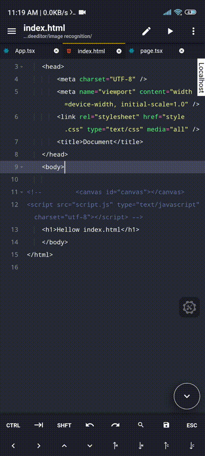

# Localhost Previewer

Overview
This plugin eliminates the need for constant context switching between your editor and browser, enhancing your productivity and development experience.

Key Features
 * Effortless Preview: preview your localhost webpages with a single click.
 *URL Caching: Localhost Preview remembers last previously opened URL.
 * Streamlined URL Management:
   * Add Shortcut: Effortlessly create shortcuts for frequently used URLs, enabling quick and convenient access.
   * Delete URL: Easily remove unnecessary URLs from the shortcut list

How to use
* after installing the plugin you will see the vertical Localhost button on editor right side. click this button to open the previewer.
* you will see default perview at port 3000 
* click link to see all options.
* options list
  * go to URL
  * add shortcut
  * delete shortcut

 